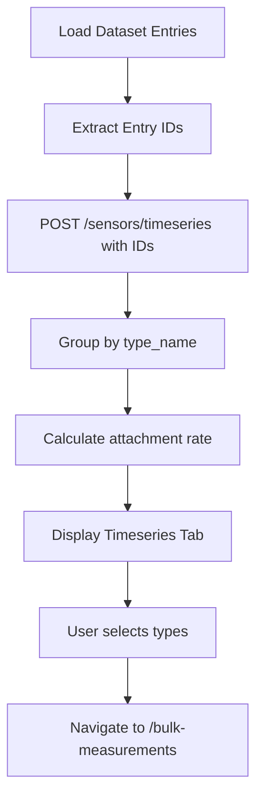
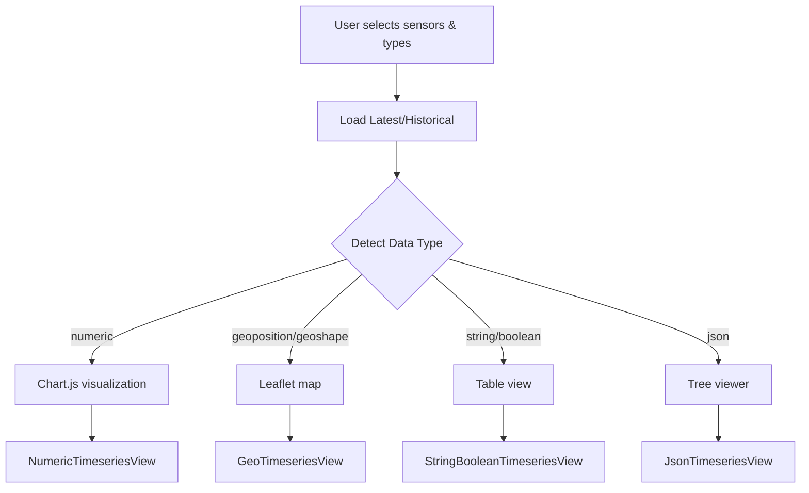

# OdhDiscovery WebApp Documentation

## Overview

The OdhDiscovery WebApp is a Vue 3-based single-page application designed to explore and visualize data from two main APIs:

1. **Content API** - Provides access to tourism-related datasets (Accommodations, Activities, POIs, Events, etc.)
2. **Timeseries API** - Provides access to sensor data and time-series measurements

### Purpose

The webapp serves as a comprehensive exploration tool for:
- Browsing and filtering large datasets from the Open Data Hub
- Analyzing dataset structure and field distributions
- Discovering and inspecting time-series data attached to dataset entities
- Visualizing measurements (numeric, geographic, JSON, etc.) from sensors
- Generating API request examples (cURL commands) for developers

### Technology Stack

- **Frontend Framework**: Vue 3 (Composition API with `<script setup>`)
- **Router**: Vue Router (Web History mode)
- **State Management**: Pinia
- **HTTP Client**: Axios
- **UI Components**: Leaflet (maps), Chart.js (charts), wicket (WKT parsing)

---

## Architecture

### API Clients

Two Axios instances are configured in `/src/api/client.js`:

- **contentClient**: Base URL `/api/v1/content` → Content API
- **timeseriesClient**: Base URL `/api/v1/timeseries` → Timeseries API

Both clients include request/response interceptors for logging and error handling.

### State Stores

#### DatasetStore (`/src/stores/datasetStore.js`)
Manages dataset-related state and API calls for the Content API.

#### TimeseriesStore (`/src/stores/timeseriesStore.js`)
Manages timeseries-related state and API calls for the Timeseries API.

### URL State Management

The app uses a custom composable (`/src/composables/useUrlState.js`) to sync component state with URL query parameters. This enables:
- Shareable URLs with pre-applied filters and selections
- Bookmarkable states
- Browser history navigation
- State persistence across page reloads

---

## Routes & Views

### 1. Home (`/`)

**Component**: `Home.vue`

**Purpose**: Landing page with navigation to main sections.

**Query Parameters**: None

**API Calls**: None

---

### 2. Dataset Browser (`/datasets`)

**Component**: `DatasetBrowser.vue`

**Purpose**: Browse available dataset types and view statistics.

**Query Parameters**: None

**API Calls**:

1. **On Mount**: `getDatasetTypes()`
   - Returns: Hardcoded list of 27 dataset types (Accommodation, Activity, Poi, etc.)
   - No actual API call - returns static list

2. **For Each Dataset (on expand)**: `GET /api/v1/content/{datasetName}?pagesize=1&pagenumber=1`
   - Purpose: Get total count of entries
   - Response: `{ TotalResults, TotalPages }`

**Data Flow**:
```
Mount → getDatasetTypes() → Display dataset cards
User clicks dataset → getDatasetMetadata(datasetName) → Show total count
User clicks "Explore" → Navigate to /datasets/{datasetName}
```

---

### 3. Dataset Inspector (`/datasets/:datasetName`)

**Component**: `DatasetInspector.vue`

**Route Parameters**:
- `datasetName` - Name of the dataset (e.g., "Accommodation", "Activity")

**Query Parameters** (all synced with URL):
- `page` (number, default: 1) - Current page number
- `pagesize` (number, default: 50) - Entries per page
- `view` (string, default: "table") - View mode: "table", "raw", "analysis"
- `rawfilter` (string) - Raw filter expression (ODH filter syntax)
- `rawsort` (string) - Raw sort expression
- `fields` (array) - Selected fields to display
- `language` (string) - Language filter
- `searchfilter` (string) - Full-text search
- `selectedIds` (array) - Selected entry IDs

**Tabs**:
1. **Data Tab** - View dataset entries
2. **Analysis Tab** - Field distribution analysis
3. **Timeseries Tab** - Attached timeseries data (if any)

**API Calls**:

#### On Initial Load:

1. **Load Dataset Entries**: `GET /api/v1/content/{datasetName}?pagenumber={page}&pagesize={pagesize}&rawfilter={filter}&rawsort={sort}&fields={fields}&language={lang}&searchfilter={search}`
   - Purpose: Get paginated dataset entries
   - Response: `{ Items: [...], TotalResults: number, TotalPages: number }`

2. **Extract Entry IDs**: From loaded entries, extract all `Id` fields

3. **Get Timeseries for Entries**: `POST /api/v1/timeseries/sensors/timeseries`
   - Payload:
     ```json
     {
       "sensor_names": ["entry-id-1", "entry-id-2", ...]
     }
     ```
   - Purpose: Find which entries have timeseries data attached
   - Response:
     ```json
     {
       "sensors": [
         {
           "sensor_name": "entry-id-1",
           "timeseries": [
             {
               "timeseries_id": "uuid",
               "type_name": "temperature",
               "type_info": { "description": "...", "unit": "°C", "data_type": "numeric" }
             }
           ]
         }
       ]
     }
     ```

#### On Page/Filter Change:

- Repeats steps 1-3 above with updated parameters

#### On Field Analysis:

- **All Filtered Entry IDs**: `GET /api/v1/content/{datasetName}?{filters}&getasidarray=true`
  - Purpose: Get all IDs matching current filters (for calculating accurate distributions)
  - Response: Array of ID strings

- **All Filtered Entries** (if needed): `GET /api/v1/content/{datasetName}?{filters}&pagesize=100&pagenumber={n}`
  - Purpose: Fetch all entries in batches of 100 (parallel requests, 5 at a time)
  - Used for: Calculating field distributions and distinct values

**Data Flow**:
```
Mount → Load Entries → Extract IDs → Fetch Timeseries
User changes filters → Reload Entries → Extract IDs → Fetch Timeseries
User clicks Analysis tab → Fetch all entries → Analyze fields → Display distributions
User clicks Timeseries tab → Display timeseries analysis
User selects types in Timeseries tab → Navigate to /bulk-measurements
```

---

### 4. Timeseries Browser (`/timeseries`)

**Component**: `TimeseriesBrowser.vue`

**Purpose**: Browse and search available timeseries types.

**Query Parameters**: None (could be extended)

**API Calls**:

1. **On Mount**: `GET /api/v1/timeseries/types?include_sensors=true&limit=100`
   - Purpose: Load all available timeseries types
   - Response:
     ```json
     {
       "types": [
         {
           "name": "temperature",
           "description": "Temperature measurement",
           "unit": "°C",
           "data_type": "numeric",
           "sensor_count": 150
         }
       ]
     }
     ```

2. **On Search/Filter**: Client-side filtering of loaded types

**Data Flow**:
```
Mount → Load All Types → Display in grid
User searches → Filter displayed types
User clicks type → Navigate to /timeseries/{typeName}
```

---

### 5. Timeseries Inspector (`/timeseries/:typeName`)

**Component**: `TimeseriesInspector.vue`

**Route Parameters**:
- `typeName` - Name of the timeseries type (legacy, now supports multiple types)

**Query Parameters** (all synced with URL):
- `types` (array) - Selected timeseries type names (e.g., `?types=temperature,humidity`)
- `view` (string, default: "table") - View mode: "table" or "raw"
- `filter` (JSON object) - Advanced filters
- `selectedSensors` (array) - Selected sensor names

**API Calls**:

1. **For Each Type**: `GET /api/v1/timeseries/types/{typeName}`
   - Purpose: Get type details and all sensors with this type
   - Response:
     ```json
     {
       "type": {
         "name": "temperature",
         "description": "...",
         "unit": "°C",
         "data_type": "numeric"
       },
       "sensors": [
         {
           "sensor_name": "sensor-123",
           "timeseries_id": "uuid-abc",
           "description": "...",
           "metadata": { ... }
         }
       ]
     }
     ```
   - Called in parallel for all selected types using `Promise.all()`

**Data Flow**:
```
Mount → Load types from URL → Load each type's sensors → Display combined table
User removes type → Update URL → Reload types
User selects sensors → Store selection
User clicks "Show Measurements" → Navigate to /bulk-measurements with sensors & types
```

---

### 6. Bulk Measurements Inspector (`/bulk-measurements`)

**Component**: `BulkMeasurementsInspector.vue`

**Purpose**: Load and visualize measurements for multiple sensors and types.

**Query Parameters** (all synced with URL):
- `sensors` (array) - Sensor names to query (e.g., `?sensors=sensor1,sensor2`)
- `types` (array) - Selected measurement type names
- `disabledSensors` (array) - Sensors that should be excluded from queries
- `view` (string, default: "table") - View mode: "table", "raw", "pretty"

**API Calls**:

#### On Initial Load:

1. **Get Available Types for Sensors**: `POST /api/v1/timeseries/sensors/types`
   - Payload:
     ```json
     {
       "sensor_names": ["sensor1", "sensor2"],
       "distinct": true
     }
     ```
   - Purpose: Get all available measurement types for the selected (enabled) sensors
   - Response:
     ```json
     {
       "types": [
         { "type_name": "temperature", "data_type": "numeric", "unit": "°C" },
         { "type_name": "humidity", "data_type": "numeric", "unit": "%" }
       ]
     }
     ```

#### When User Selects Types and Clicks "Load Latest":

2. **Load Latest Measurements**: `POST /api/v1/timeseries/measurements/latest`
   - Payload:
     ```json
     {
       "sensor_names": ["sensor1", "sensor2"],
       "type_names": ["temperature", "humidity"]
     }
     ```
   - Purpose: Get the most recent measurement for each sensor-type combination
   - Response:
     ```json
     {
       "measurements": [
         {
           "sensor_name": "sensor1",
           "type_name": "temperature",
           "timestamp": "2025-01-15T14:30:00Z",
           "value": 23.5,
           "data_type": "numeric"
         }
       ]
     }
     ```

#### When User Clicks "Load Historical Range":

3. **Load Historical Measurements**: `POST /api/v1/timeseries/measurements/historical`
   - Payload:
     ```json
     {
       "sensor_names": ["sensor1", "sensor2"],
       "type_names": ["temperature"],
       "from": "2025-01-01T00:00:00Z",
       "to": "2025-01-15T23:59:59Z",
       "limit": -1
     }
     ```
   - Purpose: Get all measurements in the specified time range
   - Response: Same as latest, but with multiple measurements per sensor

**Sensor Enable/Disable Logic**:
- All sensors in `sensors` param are displayed
- Sensors in `disabledSensors` param are shown with strikethrough and excluded from queries
- `enabledSensors = sensors - disabledSensors`
- Only `enabledSensors` are sent to API

**Data Flow**:
```
Mount → Load sensors from URL → Get available types for enabled sensors → Display type checkboxes
User toggles sensor → Update disabledSensors in URL → Reload available types
User selects types → Update types in URL
User clicks "Load Latest" → POST /measurements/latest with enabled sensors & types → Display results
User clicks "Load Historical" → POST /measurements/historical → Display results

View Modes:
- Table: Simple table with sensor, timestamp, value, type
- Raw: JSON viewer with all data
- Pretty: Group by type, auto-detect data type, render appropriate visualization:
  - Numeric → Chart (NumericTimeseriesView)
  - Geographic → Map (GeoTimeseriesView)
  - String/Boolean → Table (StringBooleanTimeseriesView)
  - JSON → Expandable tree (JsonTimeseriesView)
```

---

## URL State Composables

### `useUrlState()`
Generic composable for syncing any state with URL query parameters.

**Methods**:
- `syncWithUrl(key, initialValue, serialize, deserialize)` - Sync a single ref
- `syncMultiple(params)` - Sync multiple refs at once
- `updateUrlParams(updates)` - Update multiple params atomically

**Serializers**:
- `string` - Direct string
- `number` - Parse number
- `boolean` - "true"/"false"
- `array` - Comma-separated (e.g., "a,b,c")
- `json` - JSON.stringify/parse

### `useDatasetUrlState()`
Pre-configured for Dataset Inspector:
- `page`, `pagesize`, `view`, `rawfilter`, `rawsort`, `fields`, `language`, `searchfilter`, `selectedIds`

### `useTimeseriesUrlState()`
Pre-configured for Timeseries Inspector:
- `types` (array), `view`, `filter` (JSON), `selectedSensors` (array)

### `useBulkMeasurementsUrlState()`
Pre-configured for Bulk Measurements:
- `sensors` (array), `types` (array), `disabledSensors` (array), `view`

---

## Common API Call Patterns

### Content API

#### Get Paginated Entries
```
GET /api/v1/content/{datasetName}?pagenumber=1&pagesize=50
```

#### With Filters
```
GET /api/v1/content/{datasetName}?rawfilter=Active eq true&rawsort=Id desc
```

#### Get All IDs (for bulk operations)
```
GET /api/v1/content/{datasetName}?rawfilter=...&getasidarray=true
```

### Timeseries API

#### Get All Types
```
GET /api/v1/timeseries/types?include_sensors=true&limit=100
```

#### Get Type Details with Sensors
```
GET /api/v1/timeseries/types/{typeName}
```

#### Find Timeseries for Entities (POST recommended)
```
POST /api/v1/timeseries/sensors/timeseries
{
  "sensor_names": ["entry-id-1", "entry-id-2"]
}
```

#### Get Available Types for Sensors
```
POST /api/v1/timeseries/sensors/types
{
  "sensor_names": ["sensor1", "sensor2"],
  "distinct": true
}
```

#### Get Latest Measurements
```
POST /api/v1/timeseries/measurements/latest
{
  "sensor_names": ["sensor1"],
  "type_names": ["temperature", "humidity"]
}
```

#### Get Historical Measurements
```
POST /api/v1/timeseries/measurements/historical
{
  "sensor_names": ["sensor1"],
  "type_names": ["temperature"],
  "from": "2025-01-01T00:00:00Z",
  "to": "2025-01-15T23:59:59Z",
  "limit": -1
}
```

---

## Key Data Flows

### Dataset → Timeseries Discovery



1. Dataset Inspector loads entries from Content API
2. Extracts all `Id` fields from entries
3. Uses entry IDs as `sensor_names` in Timeseries API
4. Groups results by `type_name` to show available types
5. User can select types and navigate to measurement viewer

### Measurement Visualization



The app auto-detects measurement data types and renders appropriate visualizations.

---

## Special Features

### 1. Timeseries Attachment Detection

Dataset entries can have timeseries data attached. The app detects this by:
- Using entry `Id` as `sensor_name` in Timeseries API
- Calling `POST /sensors/timeseries` with all entry IDs
- Response shows which entries have measurements and of which types

### 2. Geographic Visualization

For geographic measurements:
- Supports WKT (Well-Known Text) format parsing via `wicket` library
- Converts to GeoJSON for Leaflet rendering
- Handles Point, Polygon, MultiPolygon geometries
- Instant view slider shows measurements at specific timestamps
- Historical view shows trajectory lines (for points) or projection quads (for polygons)
- Hash-based color assignment ensures consistent sensor colors

### 3. Field Analysis

The Analysis tab provides:
- Field name discovery (nested object traversal)
- Data type detection (string, number, boolean, array, object, null)
- Distinct value counting with pagination (1000 values per page)
- Client-side search filtering
- Null/undefined percentage calculation

### 4. URL Shareability

All view states are encoded in URL query parameters:
- Filter settings
- Page numbers
- Selected items
- View modes
- Enabled/disabled sensors

This allows users to:
- Bookmark specific views
- Share links with colleagues
- Use browser back/forward navigation
- Maintain state on page reload

---

## Component Hierarchy

```
App.vue
├── Home.vue
├── DatasetBrowser.vue
├── DatasetInspector.vue
│   ├── DistinctValuesAnalyzer.vue
│   └── TimeseriesAnalyzer.vue
├── TimeseriesBrowser.vue
├── TimeseriesInspector.vue
│   └── JsonViewer.vue
└── BulkMeasurementsInspector.vue
    ├── JsonViewer.vue
    ├── NumericTimeseriesView.vue
    ├── StringBooleanTimeseriesView.vue
    ├── GeoTimeseriesView.vue
    └── JsonTimeseriesView.vue
```

---

## Development Notes

### Adding New Dataset Types

Update `DATASET_TYPES` array in `/src/api/contentApi.js`.

### Adding New Routes

1. Create view component in `/src/views/`
2. Add route to `/src/router/index.js`
3. Create URL state composable if needed in `/src/composables/useUrlState.js`

### API Call Debugging

All API calls are logged to console via interceptors. Check browser DevTools Network tab for detailed request/response inspection.

### Performance Considerations

- Dataset Inspector loads one page at a time by default
- Analysis tab fetches all data in batches of 100 (5 parallel requests)
- Timeseries API supports bulk operations to minimize round trips
- URL state changes use `router.replace()` to avoid cluttering browser history

---

## Example User Journeys

### Journey 1: Explore Accommodations with Weather Data

1. Navigate to `/datasets`
2. Click "Explore" on "Accommodation"
3. → Redirects to `/datasets/Accommodation`
4. System loads first 50 accommodations
5. System checks which accommodations have timeseries (uses IDs as sensor names)
6. User clicks "Timeseries" tab
7. Sees "temperature" type with 15 sensors
8. Selects "temperature" type
9. Clicks "Open Selected Types in Inspector"
10. → Redirects to `/bulk-measurements?sensors=hotel-1,hotel-2,...&types=temperature`
11. User sees 15 sensors, selects types "temperature,humidity"
12. Clicks "Load Latest Measurements"
13. → API call: `POST /measurements/latest` with enabled sensors and types
14. Measurements displayed in table
15. User switches to "Pretty" view
16. → Renders Chart.js visualization for numeric data

### Journey 2: Compare Sensor Measurements Over Time

1. Navigate to `/timeseries`
2. Search for "air quality"
3. Click "air_quality_pm10" type
4. → Redirects to `/timeseries/air_quality_pm10`
5. System loads all sensors of this type
6. User selects 5 sensors from table
7. Clicks "Show Measurements for Selected"
8. → Redirects to `/bulk-measurements?sensors=s1,s2,s3,s4,s5&types=air_quality_pm10`
9. User sets date range: Jan 1 - Jan 15, 2025
10. Clicks "Load Historical Range"
11. → API call: `POST /measurements/historical` with time range
12. User switches to "Pretty" view
13. → Renders time-series chart with 5 lines (one per sensor)
14. User unchecks 2 sensors to disable them
15. → URL updates: `disabledSensors=s2,s4`
16. Clicks "Load Historical Range" again
17. → API call only includes 3 enabled sensors
18. Chart updates to show 3 lines

---

## Glossary

- **Dataset**: Collection of tourism-related entities (Accommodations, POIs, Events, etc.) from Content API
- **Entry**: Single record within a dataset (e.g., one specific hotel)
- **Sensor**: Entity that produces time-series measurements (often corresponds to dataset entry ID)
- **Type**: Category of measurement (e.g., "temperature", "humidity", "air_quality_pm10")
- **Timeseries**: Collection of time-stamped measurements from a sensor
- **Measurement**: Single data point with timestamp, value, and metadata
- **Raw Filter**: ODH-specific query syntax for filtering datasets (e.g., `Active eq true`)
- **Raw Sort**: ODH-specific sorting syntax (e.g., `Id desc`)
